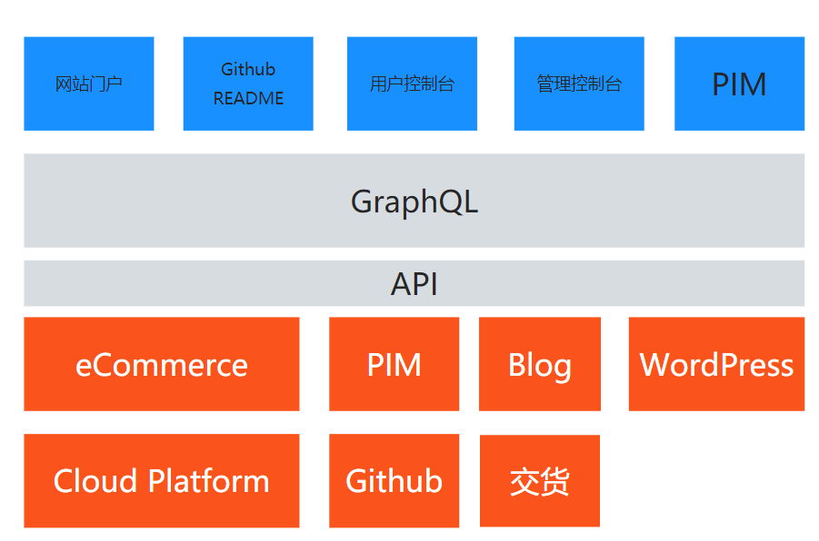

# 架构

## 前后端分离

采用 [Headless CMS](https://geekflare.com/headless-cms/) + Gatsby 的数据与交互彻底分离的方案：

* Web framework: [Gatsby](https://www.gatsbyjs.com/)
* Headless CMS: [Contentful](https://www.contentful.com/)
* Theme: [Mitech](https://themeforest.net/item/mitech-it-solutions-and-services-company-react-gatsby-template/25766950)
* 图床：阿里云对象存储
* 原型设计：[softr](https://www.softr.io/)、墨刀
* 图标：[Google Icon](https://fonts.google.com/icons)

Headless CMS 架构具备：

1. 前后端分离
2. 丰富的API
3. 提供可选的前端模板
4. 提供功能扩展APP
5. 开源免费
6. 图片管理
7. 多语言

## 多语言

采用 Gatsby 多语言框架切换多语言，多语言的数据存放在 Contentful 中或本地源码的 Json 文件中。

## 连接件

可能需要的连接件包括：

* [身份云（Authing）](https://authing.cn/)  第三方登录云平台 IDaaS
* [Anypoint Platform](https://www.mulesoft.com/platform/enterprise-integration)
* [swagger](https://swagger.io/)
* [APIgree](https://cloud.google.com/apigee/)

